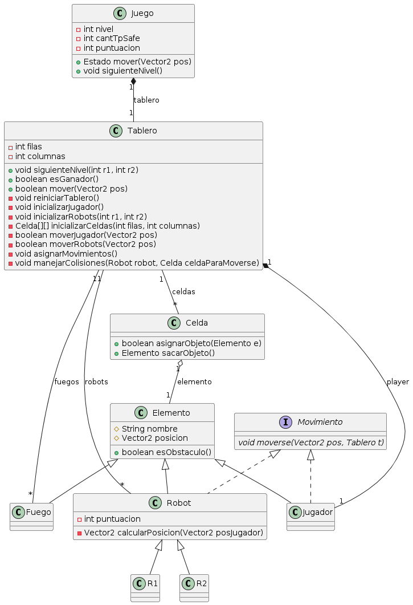

# Paradigmas-TP1

Trabajo práctico realizado para la materia Paradigmas de Programación (Cátedra Corsi-Essaya).\
Integrantes: Ezequiel Pérez Adamo (110665), Francisco López Tancredi (110464).

## Diagrama de clases

## Diagrama de secuencias

### Diagrama de secuencias secundario (movimiento)

